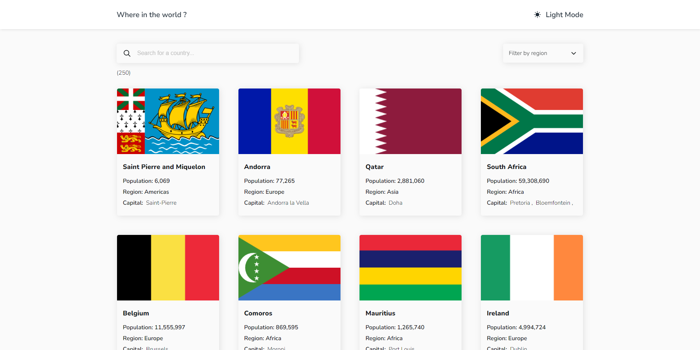
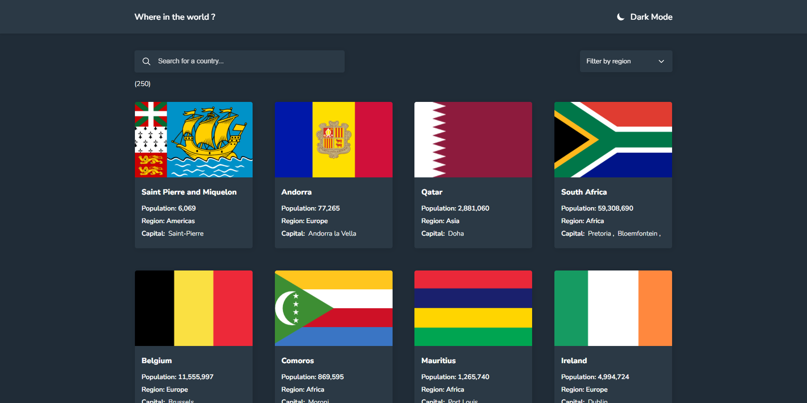
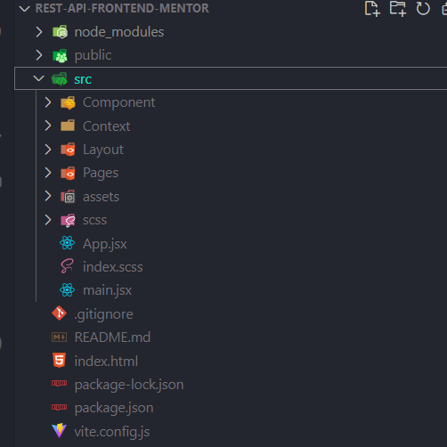
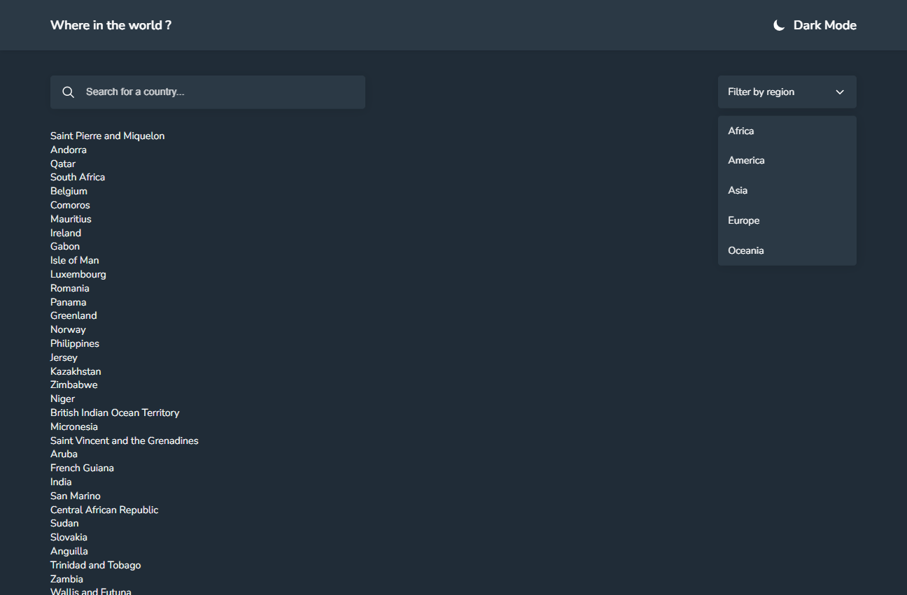
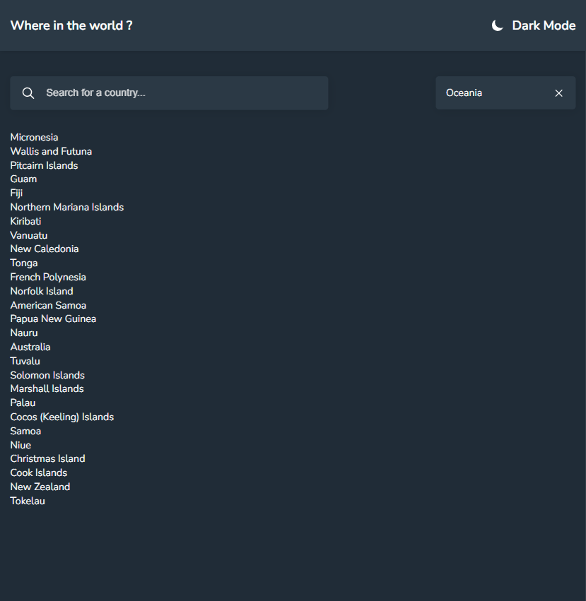

# Frontend Mentor - REST Countries API with color theme switcher solution

This is a solution to the [REST Countries API with color theme switcher challenge on Frontend Mentor](https://www.frontendmentor.io/challenges/rest-countries-api-with-color-theme-switcher-5cacc469fec04111f7b848ca). Frontend Mentor challenges help you improve your coding skills by building realistic projects. 

## Table of contents

- [Frontend Mentor - REST Countries API with color theme switcher solution](#frontend-mentor---rest-countries-api-with-color-theme-switcher-solution)
  - [Table of contents](#table-of-contents)
  - [Overview](#overview)
    - [The challenge](#the-challenge)
    - [Final build](#final-build)
    - [Final build](#final-build-1)
  - [Progress screenshots](#progress-screenshots)
    - [Folder structure](#folder-structure)
    - [Larger screens dark-mode](#larger-screens-dark-mode)
    - [Filtered result based on region](#filtered-result-based-on-region)
    - [Links](#links)
  - [My process](#my-process)
    - [Built with](#built-with)
    - [What I learned](#what-i-learned)
    - [snippets](#snippets)
    - [Continued development](#continued-development)
  - [Author](#author)

## Overview

### The challenge

Users should be able to:

- See all countries from the API on the homepage
- Search for a country using an `input` field
- Filter countries by region
- Click on a country to see more detailed information on a separate page
- Click through to the border countries on the detail page
- Toggle the color scheme between light and dark mode *(optional)*


### Final build




### Final build



## Progress screenshots

### Folder structure



### Larger screens dark-mode



### Filtered result based on region




### Links

- Solution URL: [https://rb.gy/thlyji](https://rb.gy/thlyji)
- Live Site URL: [https://ezeh-world-app.netlify.app/](https://ezeh-world-app.netlify.app/)

## My process

- created my react app using vite
- didn't configure eslint because this project size wasn't that large
- established my scss rules
- identified the components i may need then made room for them
- Mapped out my layout which consists of my navigation and container
- Created a pages folder which will house the pages that can be viewed by the user
- cleared all my console logs
- built then deployed to netlify
### Built with

- Semantic HTML5 markup
- SCSS
- Flexbox
- CSS Grid
- Mobile-first workflow
- [React](https://reactjs.org/) - JS library


### What I learned

- I learnt how to make fetch a json data and set that data in a state which is defined in a context environment in other to be used anywhere in the app
- I learnt how to route dynamically
- I learnt how to pass state through the useNavigate hook and access that state using the useLocation hook
- I also learnt how to change the theme based on the current state.
- 

Progress
- Set up file structure ...done
- Define layout and pages ...done
- Theme toggle functionality ...done
- Navigation layout ...done
- Search and filter by region feature UI ...done
- Functional Search and filter features ...done

### snippets

```js
This block of code saved me from repeating myself in another component

 const Border = borders && borders.map((border, idx) => {
        const Border = (country) => {
            const isolatedBoder = countries.filter(co => co.cca3.includes(country))
            borderNav(`/${country}`, {
                state: isolatedBoder[0]
            })
        }
        return (
            <ButtonComponent buttonType={`border`} onClick={() => Border(border)} key={idx}>{border}</ButtonComponent>
        )
    })
```

### Continued development

- Optimization of the app
- Add a bookmark feature where users can bookmark their favourite countries
- Include user authentication using firebase


## Author

- Website - [Ezeh Chijioke](https://ezeh-world-app.netlify.app/)
- Frontend Mentor - [@Ezeh20](https://www.frontendmentor.io/profile/Ezeh20)
- twitter - [@Cii_jay11000](https://twitter.com/Cii_jay11000)


I want to use this medium to acknowledge Frontend Mentor itself for pushing me to do something